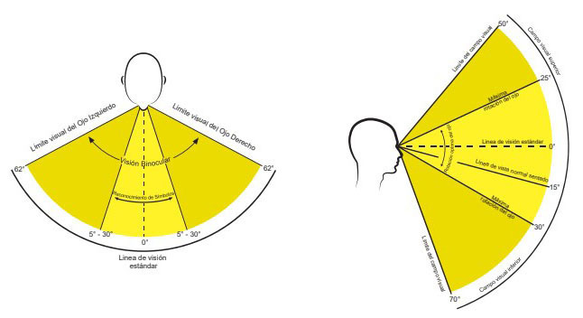

# Environment vision translator system 

Building AI course project

## Summary

This current project pretends to be a solution to sight disability by implementing a system that can recognize the environment and translate into words what the person with this disability needs to do next, is pretended to be like a helping dog, but that can actually talk! 

## Background

This idea pretends to solve the uncertainty that a blind person confront on a daily basis by just trying to go from point A to point B. The population of México in 2020 was estimated to have 415,800 people with partial or complete lack of vision, out of a total population of 126 million that makes up for 0.33% of the entire population of México with this problem. The motivation behind this project is to use AI for social purposes, to generate more trust towards AI for the general public. This topic has a core importance in enhancing technology in order to help us navigate through the uncertainties of this world. 

## How is it used?

Its intended use is to be through glasses or any device that can scan the environment in front of the blind person so that it can give insight on possible difficulties on the way. 

## Challenges

Main challenge of this project is the fact that im starting my journey as a AI developer, so this will take me a considerable amount of time to develop and test it with a person that might need this assistance. 

## What next?

The next steps are as follow:
1- Learn to program on Python.
2- Generate the algorithm that analyzes the environment in search for threats or triggers that need to generate a signal to the blind person.
3- Make a functional artifact that translates the algorithm to the real world.
4- If necessary, search for a funding campaign that helps bringing the project to reality. 

## Acknowledgments

I want to be thankful to my father and mother that raised me in such a way that im always seeking to be a good human being through Jesus Christ. 
